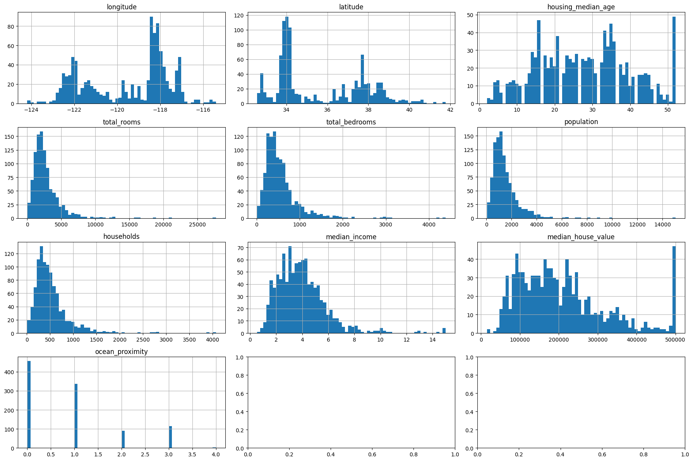

# Titanic Survival and California Housing Prediction

## Overview
This repository contains the implementation of classification and regression models using the **Titanic dataset** and the **California housing dataset**.

- The **Titanic dataset** is used to predict passenger survival using classification models.
- The **California housing dataset** is used to predict the average house values in California districts using regression models.

### Classification Models for Titanic Dataset:
- **Random Forest Classifier (RFC)**
- **Logistic Regression**
- **Support Vector Machine (SVM)**

### Regression Models for California Housing Dataset:
- **Support Vector Regression (SVR)** 
- **Linear Regression**
- **Random Forest Regression (RFR)**

This project compares the performance of these models and demonstrates their prediction accuracy.

## Results

### Titanic Dataset Classification: Predicted vs Actual
Here’s a plot showing the comparison of predicted vs actual values for the classification task:


### California Housing Dataset Regression: Predicted vs Actual
Below are the results for different regression models comparing predicted vs actual values:


### Error Rates of Different Regression Models
The following plot shows the error rates (Mean Squared Error) of different regression models:


### Feature Distribution for California Housing Dataset
Here’s the distribution of features in the California housing dataset:



## Installation
To set up the project, follow these steps:

### Clone the Repository
```bash
git clone https://github.com/your-username/Titanic-Survival-and-California-Housing-Prediction.git
